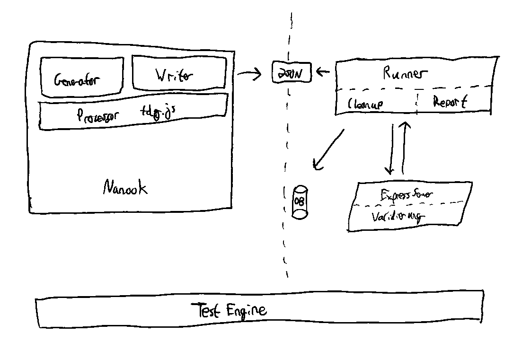

# Validation for Nanook test data

## Structure
The `Runner` class contains the fellowing methods:

`createData()` reads the directory that was added to the constructor. It parses the `runnerData.json` files and saves the testcase data.

`runValidation()` loops through every testcase and sends the data to the service. It appends the response to the testcase object and runs the `validate()` method to check if the received response is the expected response. The result of the `validate()` method is added to the testcase object. The `runValidation()` returns a Promise with an array of all testcase objects.

`generateReport(data)` receives an array with testcase data objects and generates a report.html file.

## Getting Started
To set up a Nanook Test Engine you have to set up a Runner instance. The constructor needs the following parameters:

* `tdgdir`: the path to the testcases data
* `service`: a function that receives data and returns a promise with the response
* `callStorage`: a function that receives data and stores it in a database
* `cleanupFunc`: a function that removes the data from the database
* `options`: an object with optional settings

[source,javascript]
----
const { Runner } = require("@melsicon-de/nanook-runner");

const runner = new Runner(tdgdir, fetchRegisterAPI, callStorage, clearStorage, {
  logger: true,
  report: true,
});

runner.cleanup();
runner.run();
----